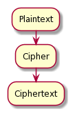

LWEncryptionMachine
===================

LWEncryptionMachine is a simple encryption machine that can encrypt a user-entered cryptographic key
and message using a Caesar cipher.

Installation
--------------

.. code-block::

    git clone https://github.com/leeway64/LWEncryptionMachine.git
    cd LWEncryptionMachine
    make build

An introduction to ciphers
---------------------------

This project uses a Caesar cipher; more information on Caesar ciphers can be found
`here <https://en.wikipedia.org/wiki/Caesar_cipher>`_.

In general, ciphers work by transforming plaintext into ciphertext through a cipher.

The previous diagram was drawn with `PlantUML <https://plantuml.com/>`_. To render the diagram, run
the following commands:

.. code-block::

    plantuml

Examples
----------

.. code-block::

    $ bin/LWEncryptionMachine
    	
    	Incorrect number of arguments. Enter the alphabet and the number of letters to be shifted by.
		For example: LWEncryptionMachine abcdefghijklmnopqrstuvwxyz0123456789 3

    $ bin/LWEncryptionMachine abcdefghijklmnopqrstuvwxyz0123456789 3

		Welcome to LWEncryptionMachine
		The program lets you encrypt a message
		with a key for your recipient to decrypt!

		Alphabet entered: abcdefghijklmnopqrstuvwxyz0123456789
		Shift value entered: 3

		Encrypted messages use a shared keyword to decrypt.
		  Enter key: Justice
			"Justice" has been encrypted to: cxvwlfh

		How many words is your message? 2
		  Next word: free
			"free" has been encrypted to: iuhh
		  Next word: tibet
			"tibet" has been encrypted to: wlehw

		Message fully encrypted. Happy secret messaging!		
		
		
	$ bin/LWEncryptionMachine ABCDEFGHIJKLMNOPQRSTUVWXYZ 7
	
		Welcome to LWEncryptionMachine
		The program lets you encrypt a message
		with a key for your recipient to decrypt!

		Alphabet entered: ABCDEFGHIJKLMNOPQRSTUVWXYZ
		Shift value entered: 7

		Encrypted messages use a shared keyword to decrypt.
		  Enter key: FREEDOM
			"FREEDOM" has been encrypted to: MYLLKVT

		How many words is your message? 4
		  Next word: EAST
			"EAST" has been encrypted to: LHZA
		  Next word: TURKISTAN
			"TURKISTAN" has been encrypted to: ABYRPZAHU
		  Next word: HONG
			"HONG" has been encrypted to: OVUN
		  Next word: KONG
			"KONG" has been encrypted to: RVUN

		Message fully encrypted. Happy secret messaging!

Running unit tests
-------------------

.. code-block::

    make run-tests

Some unit tests were influenced by certain examples given in the files section of
`Assessment 3 <https://courses.cs.washington.edu/courses/cse142/21su/assessments/a3/>`_
for `UW Seattle CSE 142 (summer 2020) <https://courses.cs.washington.edu/courses/cse142/21su/>`_.

Acknowledgements
------------------

This project is based on `Assessment 3 <https://courses.cs.washington.edu/courses/cse142/21su/assessments/a3/>`_
for `UW Seattle CSE 142 (summer 2020) <https://courses.cs.washington.edu/courses/cse142/21su/>`_.
The assignment was originally meant to be completed in Java, but I completed it in C.

Third-party software
----------------------

- `CMake <https://cmake.org/>`_ (BSD 3-clause License): C/C++ build system
- `CuTest <http://cutest.sourceforge.net/>`_ (zlib License): C unit testing framework.
