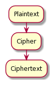
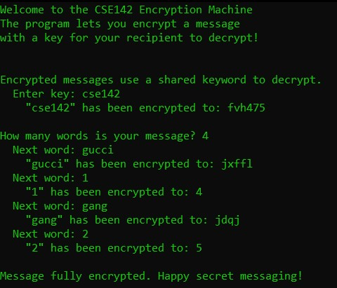
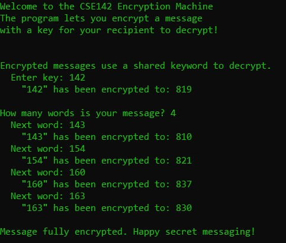

Encryption Machine
===================

This project created a simple encryption machine that can encrypt a user-entered cryptographic key
and message using a Caesar cipher; more information on Caesar ciphers can be found
`here <https://en.wikipedia.org/wiki/Caesar_cipher>`_.

In general, ciphers work by transforming plaintext into ciphertext through a cipher.

The previous diagram was drawn using `PlantUML <https://plantuml.com/>`_ and rendered on
`this <https://www.planttext.com/>`_ site.

Consider the following execution examples.

With an alphabet of "abcdefghijklmnopqrstuvwxyz0123456789", shift of 3
~~~~~~~~~~~~~~~~~~~~~~~~~~~~~~~~~~~~~~~~~~~~~~~~~~~~~~~~~~~~~~~~~~~~~~~

With an alphabet of "0123456789", shift of 7
~~~~~~~~~~~~~~~~~~~~~~~~~~~~~~~~~~~~~~~~~~~~~

References
-------------

This project is based on `Assessment 3 <https://courses.cs.washington.edu/courses/cse142/21su/assessments/a3/>`_
for `UW Seattle CSE 142 (summer 2020) <https://courses.cs.washington.edu/courses/cse142/21su/>`_.
The assignment was originally meant to be completed in Java, but I completed it in C.

The unit testing framework used for this project was `CuTest <http://cutest.sourceforge.net/>`_.
